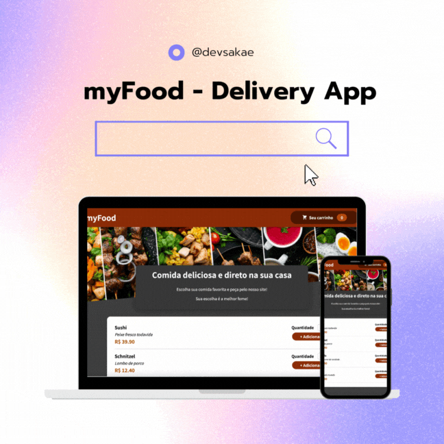

# myFood
Uma aplicação básica de delivery de comida. Criado com instruções e CSS (básico) de Maximiliam Schwarzmuller.

## Como instalar?
Faça o clone deste repositório com <code>gh repo clone devsakae/myfood</code>

Instale as dependências com <code>nom install</code>

Rode o projeto com <code>npm start</code>
